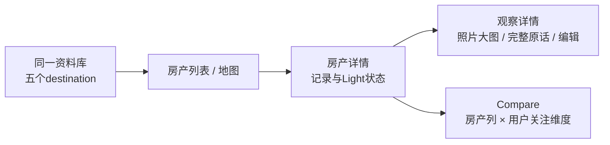

# Property Replay · UI/UX 深度评审与适配改进方案

- 日期：2026-10-01（Australia/Melbourne）。基线：`cd79f836ea624cf61d308e1a4777849a5027ec90`，分支 `feat/inspect-screen`。
- 范围：用户任务、五个 tab、地图、记录与复看、Light 扫描、iPhone/iPad、旋转、字号、深浅色、输入、辅助功能、状态与反馈。
- 方法：按 Lee 点名的 ui-ux-pro-max、apple-design、jobs-simple-design 执行；参考当前规范、源码、Apple 官方资料，以及本轮隔离的合成 UI 测试。
- **本轮只评审和出方案。原项目业务代码、Xcode 工程、系统外观和真实资料未改，未提交或推送。** 测试代码与深色外观注入仅在 `/private/tmp` 源码副本。

## 1. 核心判断

产品方向不用再改：保留 Property、五个 tab、Properties 内 List/Map、现场记录和 Light。当前应把注意力从“增加功能”转到“不同设备上是否真能看、能操作、能纠错”。

**最高优先有三组：**
1. 最大辅助字号下的真实溢出；横竖屏相机预览/照片/叠加的统一方向契约。
2. 回家复看时，照片可放大、原话可完整读和修正、观察能进入详情。
3. 状态诚实：镜头扫过不等于天空无遮挡，扫描保存不等于日照已算好，iCloud开关打开不等于每条资料已同步完成。

设备分工建议：**iPhone快速记录，iPad从容复看和并排比较**。功能和资料模型保持一致，布局与主要操作按当前窗口空间改变。不是把手机页面拉宽。

三个skill的使用边界：Jobs方法用于任务、层级与取舍；Apple方法用于连续反馈、空间关系、材质、字形和恢复；Pro Max用于触达、动态字号、表单、响应式与可访问性检查。网页像素、CSS、ARIA、GSAP示例没有直接移植到SwiftUI；不以“必须全用弹簧/玻璃”替代产品判断。

## 2. 本轮证据与限制

### 实际执行

- 从基线git archive生成临时副本；审计App使用单独 bundle `com.pwegroup.propertyreplay.uxreview`。
- 使用已有 DEBUG 的 `-uitest` 内存资料库、虚构房产、假照片和假AR扫视；不测试用户真实房产或云端同步。
- iPhone 17 Pro / iOS27：四个合成UI流程通过；iPad Pro13 / iOS27：相同四个流程通过。
- 补测：iPad稳定横屏一次；iPhone深色外观/表单文字输入一次，均通过。
- 共 **10次UI测试执行、6个不同测试方法、64张截图及对应AX树**。流程通过不代表布局通过，也不代表真机传感器精度通过。
- 大字通过启动参数注入最大辅助内容字号；截图和AX位置确认了布局实际变化。
- iPhone设备旋转后App窗口仍为402×874pt，符合当前全App竖屏配置。iPad稳定横屏窗口1376×1032pt。
- 首轮旋转立即截图出现转场中间态；已补稳定采样。横屏PNG另带方向元数据，一些查看器会额外旋转/产生黑边；**不把这些显示伪影判为App稳定布局bug**。
- 首轮Xcode测试结束后simctl诊断收集挂起；只取消本轮两个诊断子进程，Xcode最终均报 TEST SUCCEEDED。补测使用 `-collect-test-diagnostics never` 正常完成。

### 本轮没有验收

- 真机相机在四个方向上的预览与输出照片一致性；AR太阳轨迹的物理对齐。
- 320/375pt窄手机、iPad mini、任意浮动窗口和分屏宽度的全部组合。
- 实际开启VoiceOver、Switch Control、减弱透明度、提高对比度，以及外接键盘完整旅程。
- 深色补测在临时App注入 preferredColorScheme，未改变系统深色设置；不等于所有设备/背景对比度已达标。
- 表单键盘输入已执行，但软件键盘未在有效屏幕区域呈现；**不宣称键盘挤压/遮挡已验收**。
- 用户访谈与可用性实验。方案里的宽度、触感、时间与样本阈值均为候选，不是已经达到的成绩。

### 代表性截图（均为本轮合成资料）

- [最大字号的记录卡片](assets/2026-10-01-uiux/phone-large-photo-card.png)、[对应AX边界](assets/2026-10-01-uiux/phone-large-photo-card-AX.txt)。
- [最大字号的Light顶部](assets/2026-10-01-uiux/phone-large-light.png)、[最大字号的结果卡](assets/2026-10-01-uiux/phone-large-light-result.png)。
- [最大字号的列表](assets/2026-10-01-uiux/phone-large-list.png)、[iPad当前单列列表](assets/2026-10-01-uiux/ipad-portrait-list.png)。
- [深色记录卡](assets/2026-10-01-uiux/phone-dark-photo-card.png)、[深色文字输入表单](assets/2026-10-01-uiux/phone-dark-add-input.png)。
- [稳定横屏窗口AX](assets/2026-10-01-uiux/ipad-landscape-photo-card-AX.txt)。部分截屏是转场采样，稳定位置以AX及后续重复采样共同核对；不将正常卡片入场中的局部遮挡宣称为持久布局缺陷。

## 3. 保留、调整与按需展示

| 对象 | 判断 | 理由 |
|---|---|---|
| 五个tab | 保留 | 用户已决定；Before/During/After与偏好职责清楚 |
| Properties List/Map | 保留并共享筛选/选择 | 两种视角看同一批房，不建两套状态 |
| Inspect三个动作 | 保留 | Capture / Note / Light服务不同任务；不合成含糊的“AI”入口 |
| Light单句指引、圈、路径 | 保留 | 当前下一步清楚，比分页仪表盘更适合现场 |
| Light路径虚线/实线 | 保留 | 已有非颜色差异，补清楚的图例 |
| R0/原始采集/设备能力 | 按需展示 | 消费者主界面用“轨迹预览/尚未分析”；原始证据进详情或调试 |
| iCloud私有同步 | 保留 | 明确手机记录→iPad复看任务；状态说明需完善 |
| 大面积玻璃 | 调整 | 控件适合材质；长文结果、编辑表单以稳定可读底色为主 |
| 黑盒总分/自动推荐买房 | 不添加 | 与已接受的用户优先级和证据原则冲突 |

## 4. 高优先级发现与具体改法

P1：消费者可用性/核心操作之前应处理。P2：下一轮体验迭代。P3：打磨。证据分别注明运行、源码或待设备验证，不给无依据的“UI分数”。

### U01 · P1 · Inspect在最大字号下横向溢出

**运行证据**：`phone-large-photo-card.png`。AX显示地址x=-110pt，Discard x=-98pt，Ask右边约492pt，Save右边约500pt，而窗口只有402pt宽。文字和操作不再完整处于可见区域。
**源码**：`InspectView.swift:27–47,106–120`、`ObservationCard.swift:11–57`；整块header/草稿卡/控制栏在同一不可滚动VStack，固定宽度与fixedSize标签共同扩大最小宽度。
**改法**：header在大字/窄宽度下上下排列；房产地址允许合理换行，房间选择另起行；草稿使用可滚动编辑区，Save/Discard保持独立安全区；Like/Concern/Ask在不足宽度时换行或竖排。以 ViewThatFits/布局策略选择，不强行缩小正文或关闭Dynamic Type。
**验收**：375/402pt、最大辅助字号、长地址/中文，所有操作在窗口内或可滚动到；触摸与VO都能保存/丢弃，草稿不因切布局丢失。

### U02 · P1 · Light顶部和结果卡的大字布局失效

**运行证据**：`phone-large-light.png`、`phone-large-light-result.png`。“Winter sun”被挤成单字列，AX按钮高约311pt；结果标题、Grid的标签/值、Scan again/Done大量截断。
**源码**：`LightScanView.swift:108–141,225–267`。顶部固定一行，结果固定两列，没有按字号重排或滚动。
**改法**：Close保持固定触达区；问题选择独立一行；方向状态作为可展开的简短摘要。结果大字模式用一列“标题→值”；正文可滚动，底部Done固定，Scan again次级。进度数字若无法放入58pt圈，移到圈旁文本，圈仍作图形。
**验收**：最大字号下至少读全问题、未分析说明和主操作；不以只剩“…/单字列”作为完成状态；VO按结果→原因→下一步阅读。

### U03 · P1 · iPad允许旋转，但照片输出仍硬编码90°

**源码**：`ios/project.yml:44–46,67`支持iPad四向；`CameraService.swift:47–50`每次固定 `videoRotationAngle=90`；`CameraPreview.swift`未见方向更新。
**风险**：用户横拿iPad时，预览、保存照片和之后复看可能不一致。本轮使用假照片，不能证明真机已经拍歪，也不能证明旋转无问题。
**改法**：建立RotationCoordinator驱动的预览与捕获角度；图像方向/EXIF、缩放与裁切一起记录。不要简单把屏幕角度直接塞给照片，预览和捕获各有自己的角度；不要靠旧的UIDevice私有KVC强转。
**官方依据**：[AVCaptureDevice.RotationCoordinator](https://developer.apple.com/documentation/avfoundation/avcapturedevice/rotationcoordinator)分别提供预览与捕获所需角度。
**验收**：iPhone竖持、横持，iPad四向，分别拍有“上/右”标记的合成实体板；预览/照片/缩略图/大图方向一致。再查AR坐标投影，而不是用一段UI旋转动画证明物理正确。

### U04 · P1 · 保存的照片和原话无法完整复看

**源码**：`InspectionSummaryView.swift:34,49–75`：只有56pt缩略图、三行标题、两行metadata，行不是详情NavigationLink；`ObservationCard`原文是Text而非可编辑输入。
**影响**：看房记忆已能存，但回家用iPad还不能看清窗、放大细节、读完长语音或纠正转写。它比新的动效更直接影响产品价值。
**改法**：ObservationDetail：照片大图、缩放/平移/复位、完整原话、房间/标签、来源、采集时间；允许修正转写与分类，保留原文，AI建议独立可接受/撤销。iPad从侧栏或列表选一条后就地展示详情。
**验收**：中文长句、十行语音、纵/横照片都能完整查看与编辑；修改跨设备可辨认，来源不会静默变Verified。

### U05 · P1 · 长按录音是自定义手势，没有完整按钮语义

**源码/AX**：`InspectView.swift:182–200`是VStack+DragGesture；AX将“Hold to note”呈现为StaticText，不能把默认长按当作VO或键盘唯一入口。
**改法**：默认继续push-to-talk；语义化控件明确名称、状态和可用性；给辅助功能一个可执行的开始/结束/取消路径，用户能知道麦克风何时开放。键盘可提供等效按下/松开动作。准备模型与真正录音分开显示；取消后不得继续记录。
**验收**：实际VO、键盘/Switch Control完成一条记录；离开/后台/取消停止；屏幕朗读不被误收成买家原话。是否提供普通用户“点击开始/结束”的第二模式，另作产品决定，不偷偷改ADR-0015。

### U06 · P1 · 视野覆盖、天空判断、日照结果需要清楚区分

**源码**：`docs/04 §11`、SkySweep/CorridorProgress统计的是镜头看过的方向；ScanCoach“That's enough sky”，绿色成功反馈和太阳黄色实线很容易被读成已有采光判断。
**改法**：主句“已覆盖所需视角，可以保存这次记录”；初次帮助解释实线=镜头已覆盖、虚线=尚未覆盖。结果显著分开“记录已保存”和“日照尚未计算”；当前不出小时数。不要把100% seen展示成100%日照/可信度。
结果文案“will be analysed then”也需收窄：当前R0没有存完整天空图像/分割资产，不能承诺以后必然能自动补算；写清未来可能需要补采。
**验收**：目标用户能说清“保存了什么/还没得到什么”，而不靠读小脚注才能发现。

## 5. 跨设备与旋转方案

### 5.1 当前配置并不等于完整适配

- iPhone：全App只支持portrait。本轮实际旋转后窗口仍402×874pt，不能把这些测试当成iPhone横屏通过。
- iPad：原生family1,2与四向支持已开启；单列内容和相机方向管线仍未完成适配。
- iPad窗口宽度可以变化，不能只看UIDevice是pad，也不能只按portrait/landscape分支。[Apple iPad设计讲解](https://developer.apple.com/videos/play/wwdc2025/208/)强调按可用宽度重排，并在调整窗口时保留状态。

### 5.2 推荐布局契约（宽度只是原型候选）

| 当前场景 | 推荐呈现 | 主操作 |
|---|---|---|
| iPhone竖屏/很窄窗口 | 五tab+单列导航；记录卡可滚动；底部安全区CTA | 现场快速Capture/Note/Light |
| iPhone横屏阅读（建议开放） | 大图/完整原话/两套比较更充分；控制与内容分区 | 复看/比较 |
| iPad窄窗口/最大字号 | 自动退回单列；不强塞sidebar/三列 | 同一任务，不丢上下文 |
| iPad中等宽度（可先试600–999pt） | Properties列表或地图+详情两列；设置列表+设置内容 | 找房并读细节 |
| iPad宽窗口（可先试≥1000pt） | 可适配侧栏+列表/地图+详情；Compare按列 | 在家复看、编辑、并排比较 |
| iPad横屏采集 | 取景器+窄编辑栏，或底部compact操作簇；不把卡片撑满全宽 | 可记录，但先验旋转与触达 |

候选宽度不是Apple强制值。判断还要考虑Dynamic Type、内容长度、窗口实际尺寸与外接输入；以真实布局能否放下为准。对大字宁可单列、可滚动，不能为“iPad必须三列”牺牲内容。

### 5.3 旋转的四个独立问题

1. **界面重排**：控件换位置，保持当前Property、草稿、地图选择和比较对象。
2. **相机方向**：预览与捕获angle各自协调；保存后不倒置。
3. **空间投影**：AR原始像素/内参/显示裁切/viewport对应，不能仅旋转线条。
4. **采集身份**：旋转不重开inspection，不重新创建scene/model，不悄悄清覆盖或更改目标点。

如果短期只保证手机竖屏采集，应明确限制在采集场景，不用全App竖屏锁阻止回家看照片。推荐先开放阅读横屏、补相机方向后再开放全部采集；实现前确认范围。

## 6. 按页面列出的改进清单

### U07 · P2 · iPad导航与内容密度

`RootView`是五Tab+各自NavigationStack，未见sidebarAdaptable/NavigationSplitView。iPad列表截图显示三条记录横跨整个屏幕，大片空间没有服务选择和阅读。

建议保留五个destination，允许tab/sidebar系统适配；Properties用列表/地图与详情分栏；You宽屏用分组列表+右侧内容。设置/说明正文可先试620–760pt可读宽度，照片/地图/比较使用剩余空间，不是全站统一限宽。
验收：宽窄窗口切换，选择/返回/滚动/草稿保留；sidebar没有重复五套导航。

### U08 · P2 · Home从宣传页变成下一步入口

`HomeView.swift` Next inspection与Recent可重复同一套；只有进入详情后再找开始。
建议：Next卡直接“开始看房”；复看最近已记录的两三套；排除Next重复项；有未保存/待关联记录时显示可恢复入口。空态保留一条价值句+添加，不先向新用户索取全部权限。
验收：从Home开始指定房产不需要猜去哪个tab；测试者能区分“下次预约”与“最近记录”。

### U09 · P2 · Properties搜索、筛选与地图共用状态

当前按状态分组但无搜索/筛选；Map独立selected，退出详情/切模式的上下文未统一。
建议searchable搜地址/区名；状态筛选同时作用于List和Map；同一个selectedProperty UUID驱动高亮和详情。用户切模式时保留选择和范围，不每次缩放到全世界。
验收：选B房→Map→详情→List仍是B；筛选后列表计数与pin数解释一致，无pin有修正入口。

### U10 · P2 · 地图所选卡片应能直接服务看房

`PropertiesMapView.swift:47–60`卡片主要是地址/状态+小箭头。
建议整卡可进详情；有明确“开始看房”“加入比较/已加入”上下文动作；导航到房产用系统Maps交接，不做新路线平台。iPad用并列详情代替横跨屏幕的底部卡片；手机用safeAreaInset或有可见底部的系统sheet，避免遮pin/系统归属信息。
验收：大字、长地址、无定位、定位拒绝都可选房；动作不自动替用户确认“我就在这里”。

### U11 · P2 · Inspect选房减少步骤但保留确认

`InspectTabView`按钮Sort by location且CLLocation精度需求为100m；一旦有定位按钮禁用，跨下一套不刷新。
建议已有授权时可自动列“附近”，显式确认房产后开始；未授权也能按列表选。到另一套后可刷新，显示定位不可用的原因与继续路径；不把最近pin当作自动确认地址。
验收：相邻两套、偏移定位、拒绝权限、移动到新街区，没有串房采集。

### U12 · P2 · 房产详情先看记录，不先看编辑表单

`PropertyDetailView`首屏可编辑地址/状态/时间，核心Inspect/Light需要向下寻找，Prep仍是工程占位。
建议主头部地址+状态+开始看房/Light；预约未安排就写“未安排”，不要用Date()做显示值冒充预约。记录与问题随后；地址/pin等编辑放“编辑房产”。Prep未准备好时不显示开发者文案。
验收：首次看到能立即识别资料、进入记录或复看；误触不会改地址。

### U13 · P2 · 记录详情、房间/日期筛选与原文纠正

按Liked/Concern/Ask分组有价值，保留；加房间和看房日期筛选、照片/语音/light类型入口。行可进详情（U04）；同一观察在多分组里保持同一ID，不复制资料。
“Ask next”当前是标签集合，不应伪装成专业判断；可改为“你想确认的事”，编辑为完成/未完成并按需要标问谁，Question独立模型后续再做。
验收：读完长句、改错字、调整标签、查另一场inspection，看到的内容和保存的内容一致。

### U14 · P2 · Compare要真正并排，并解释不同Unknown

`CompareView.swift:48–60`实际是维度下依次列房产，每格同一句Unknown·not measured yet，没有真正的列布局；4th选择会静默忽略，空态没有添加或优先级直达。
手机：固定房产标题，最多两三列，必要时仅比较两套；保留用户维度。iPad：按行是维度、按列是房产，头部/首列可稳定对应。
Unknown分“未记录/尚未计算/待确认/没有资料”，每格可跳到原始照片或原话。不引入客观总分。无偏好给直达选择；到3套时明确已达上限。维度暂无数据也不以伪指标填满。
验收：用户不需要来回记忆A/B；VO能读“房产→维度→来源→状态”；选择上限有反馈。

### U15 · P2 · You按偏好、记录设置、同步、帮助分层

保留个人名字和最多5个偏好；不为“个人信息”增加无任务价值的字段。录音语言、默认目标高度保留；Advanced(spike)/Viewpoint tolerance/设备能力收进内部构建或诊断，不混在普通设置中。
当前Haptics on timeline没有已实现timeline：暂隐藏或说明适用功能；如作为全局触感偏好，应被Light读取。iPad无触感也必须有视觉/语义反馈。
验收：每个开关今天起作用或明确生效时间；用户不必理解AR误差才能完成首次采集。

### U16 · P2 · 同步状态不要等同“已备份”

You只展示账户/容器模式；开关次启动生效。建议区分当前“此设备/私有iCloud启用/待生效/无法同步”；只有确有同步事件证据才写完成时间或“已同步”，不要仅凭登录状态逐条打勾。
新iPad资料暂缺时给等待/检查账户/继续本机的解释；尚未关联的扫描清楚说明目前仅本机。删除确认明确跨设备影响，成功/失败反馈应与真实持久化状态一致。
验收：未登录、离线、开关后未重启、新iPad首次进入、删除传播，都不会给用户错误的资料安全印象。

## 7. 工艺与完整交互

### U17 · P2 · 亮/暗相机画面上的header与证据长文

Inspect地址/计数直接压在实时画面，前景primary/secondary会随系统主题而非照片亮度变化。假相机截图不能代表强光/暗室可读性。
建议header小块稳定材质或scrim；只在必要控件用玻璃。结果正文用不透明/足够稳定的surface，减少透明度或高对比时有实色退路。系统glass可能自动响应设置，不能因没写Env就断言系统不支持；自绘图层和长文仍须检查。
验收：白墙、暗墙、逆光窗、复杂照片、深浅色分别读清；不凭单张截图声明所有对比度达标。

### U18 · P2 · 点击区域与可访问性语义

本轮AX常规卡片：房间/类别约28pt高，Like/Concern/Ask约32pt，Save约30pt，Discard约16pt；应显式设计≥44×44pt命中区域并用Inspector验真正hit区，**AX frame不一定等于最终触摸扩展范围**。Light的Close虽然icon是30pt，实际AX为44×44pt，不能把它误报成过小。
语义：整个保存/丢弃是Button；Note加语义替代；照片有描述与进入大图提示；选中标签和地图状态不要仅靠色。错误与关键扫描指引可做节制的公告，不每帧打断VO。
验收：一手、VO、键盘焦点，所有操作可发现/激活/取消，朗读顺序与视觉对应。

### U19 · P2 · 动效完整性与按下反馈

Light已有reduceMotion、克制spring、达标/保存触感，保留。Inspect仍有固定easeOut和80ms全屏闪白；Map卡片默认move动画未有明确退路；plain自定义按钮缺明显按压态。
改法：先用原生ButtonStyle的即时按下反馈；自定义变换若用缩放，先试0.97左右，保持命中区域，避免机械全用0.94。快门反馈限取景器区域，减少动态时用静态/淡入反馈。状态可中断，保存/取消不等动画才响应。
候选spring response0.3–0.4、无过冲是起点，不是把阻尼比直接当所有API的damping参数。成功触感只表示真实事件，不表示算法已准。
验收：快速保存/取消、反向操作、减少动态、高对比，状态不闪回，不重复保存。

### U20 · P2 · 草稿编辑不是永远堆在取景器上

常规字号的拍照/记录/保存路径已有UI测试；保留单一Binding与草稿ID修复。手机可用可滚动底部编辑面板，大字升级为完整编辑sheet；iPad用可读宽度侧栏。保存/丢弃留在编辑区，退出归属于整次看房，分清两个层级。
AI返回时尊重用户已改字段；展开摘要/原文不会清掉内容；不同草稿旧任务不能串入。不要用无脑重建视图解决绑定。
验收：十行转写、AI慢三秒、手改房间、横竖切换、键盘出现，编辑和实际保存一致。

### U21 · P2 · 键盘和输入模式

表单优先把焦点放在地址，搜索结果保持可选；保存/取消在软件键盘出现时仍可见；标清网络解析状态而非把空列表等同没有地址。语音纠正页应有可编辑正文与明确完成按钮。
iPad外接键盘可先提供 Cmd-N添加、查找、Escape退出（有草稿时进入保护流程），并显示焦点。不能依赖hover或长按完成关键操作。
本轮输入测试仅证明能填文字；软件键盘区域在AX位于屏幕之外，遮挡行为未验收。

### U22 · P2 · 失败必须保留输入并给下一步

地址失败：继续不带pin/重试；录音模型未安装：下载状态与取消，保留手写入口；AI不可用：正常手选；扫描未覆盖：继续/保存不完整记录；已存本机但未挂房产：重试/稍后，不说“全失败”。
当前Light保存失败结果主要给Scan again/Done；需明确“重试保存原扫描”与“重新扫”的区别，不要求用户为短暂IO问题重新采集。权限拒绝提供系统设置入口与替代行为。
验收：每种状态用户都能回答“发生什么/资料是否还在/现在能做什么”。

### U23 · P2 · 问题切换时完成态要同步

`LightScanModel.refreshStatus` reachedTarget只在达到门槛后置true；扫描中允许Winter/All-year切换，旧的reachedTarget可能使新问题进度不足仍显示绿色/主Save。这是源码风险，本轮固定问题测试没有覆盖。
建议达标状态由当前question+coverage计算或切换时重算；重算中有短状态；保留可复用的采集方向，不强制重扫。
验收：Winter达标→All-year未达→再返回Winter，百分比、颜色、指引、Save级别一致；低覆盖仍询问。

### U24 · P3 · 文案、本地化与视觉tokens

英文/中文界面用String Catalog，枚举存稳定ID，只翻译显示名，不翻译用户原话。当前中文转写不等于已有中文UI。长中文地址、英文区名、日期、复数、房间自定义名分别查。
R0、SceneRecord、σ、spike、Device capabilities不作为首屏文案。消费者证据可用“现场记录/按当前条件推算/AI整理待确认/资料不足”，详细来源点击展开；不擅自改科学证据定义。
统一SF字体和spacing（可从4/8pt增量开始），蓝色主操作、太阳黄轨迹、绿成功、橙待确认；正文读清优先于品牌色。小字号不全局紧字距。
验收：本地化、动态字号和深浅色不改变事实与数字；暂未实现的功能不伪装可用。

## 8. 推荐页面形态

### iPhone现场

`Properties/附近选房 → Inspect → 拍照/按住说话/Light → 编辑并保存 → 继续记录 → Done → 看房摘要`

- 房产详情有Inspect与Light直达；相机只一个来源。
- 手上正在编辑草稿时主操作是Save，开始新Capture和整次Done为明确次级动作。
- Light：准备→扫描→覆盖/质量反馈→保存结果；Close/取消始终可找，阶段状态不同但词义一致。

### iPad复看

这是一套可折叠的关系，不强制每台iPad同时显示四列。窄窗口返回单列，当前选中对象与编辑会话不变。

## 9. 实施阶段和验收矩阵

### 第一批 · 把内容与操作做完整

U01/U02大字重排；U04观察详情；U05辅助输入；U06诚实状态；U12预约与主操作层级。修改这些时保留已有草稿/失败保存的回归，不为排版重新建一套数据。

### 第二批 · iPad与旋转

U03相机管线；U07分栏；U09/U10共享地图状态；U14比较表；窗口缩放保留状态。先做可读两列，再按证据考虑第三列。

### 第三批 · 反馈、同步、本地化

U16同步状态；U17–U22材质、命中、动效、编辑、键盘、失败；U23问题完成态；U24文案。触感/玻璃是最后一层工艺，不能替代完整流程。

| 组合 | 必测操作 | 本轮覆盖 | 下一轮验收 |
|---|---|---|---|
| iPhone402pt常规 | 保存/丢弃、Light低覆盖、Map/List、Compare | 合成流程通过，已取截图 | 真实输入、操作触达与复看 |
| iPhone最大辅助字号 | 地址、标签、Light顶部/结果 | 已发现溢出/截断 | 横向不溢出，所有正文/操作可达 |
| iPhone375pt/更窄 | 中文长地址、草稿、键盘 | 未测 | 以实机支持机型/真实窗口为准 |
| iPhone横屏 | 查看照片、Compare、采集 | 当前锁竖屏 | 开放范围决定后测，不宣称已支持 |
| iPad13竖/横 | 列表/Map、记录卡、Light | 合成流程通过；不是分栏验收 | 可读宽度、稳定窗口与选择保留 |
| iPad mini/窄窗口 | 分栏折叠、表单、结果 | 未测 | 不仅按设备型号判断布局 |
| 深色 | 表单、记录卡、Light | 临时副本App外观注入并取图 | 真实相机背景/全页面对比 |
| 软件/外接键盘 | 输入/取消/焦点/保存 | 文字输入通过；软件键盘遮挡未测 | 不遮字段、关键操作可达 |
| VO/Switch Control | Note、Save、Map、结果 | 仅AX/源码审查 | 实际开辅助功能完成全任务 |
| 减少动态/透明、高对比 | 扫描指引、卡片、材质 | 部分源码已有；未开系统完整测 | 等效反馈，可读且不丢状态 |
| 真实相机四向 | 预览/捕获/缩略图/叠加 | 未测 | 实体方向板+真实AR标记验证 |
| 离线/首次同步 | 新iPad打开、保存与恢复 | 未测 | 诚实状态、资料可找回 |

验收不能只断言 exists/可tap：还要检查关键元素与文字在可见窗口内、能完整读/滚动到、实际保存内容匹配；照片方向与空间对齐另做真机验收。布局转场检查稳定状态与中间态分开。

## 10. 复现与来源

- 源码副本、临时UI测试类、四个xcresult与全部附件：`/private/tmp/propertyreplay-ux-20261001/`。临时目录不是长期备份。
- 审计使用自定义 [UXReviewUITests](assets/2026-10-01-uiux/UXReviewUITests.swift)，没有将它加入原项目编译目标；代表性截图与AX随本报告归档。深色补测仅在临时App根视图按 `-ux-dark` 调用 preferredColorScheme，不是原项目新增功能。
- 官方：[Apple Layout](https://developer.apple.com/design/human-interface-guidelines/layout)、[iPad宽度/窗口适配讲解](https://developer.apple.com/videos/play/wwdc2025/208/)、[RotationCoordinator](https://developer.apple.com/documentation/avfoundation/avcapturedevice/rotationcoordinator)。用于平台方向，不代表本项目已符合。
- 三个本地skill使用当前文件；新方案不改既有蓝图或核心ADR。UI Pro Max的通用搜索还混有web条目，已按SwiftUI上下文取舍，没有照搬其配色/字体/GSAP模板。

**本轮交付的是改进方案与验收定义；没有实现这些改动。**
